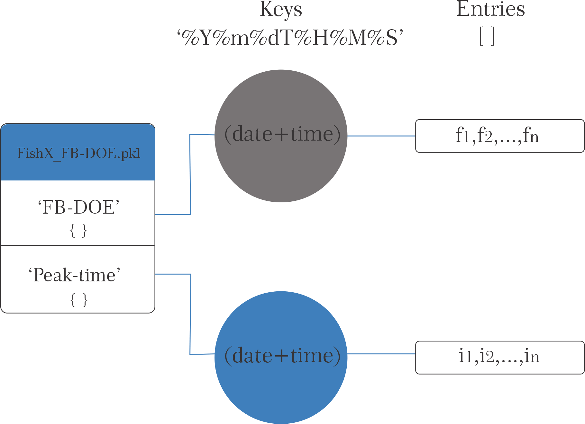

# efish_analysis

Este repositorio contiene scripts para analizar los datos obtenidos de la estacion conductual de peces eléctricos de Facultad de Ciencias (Dentro del sub repositorio - Gymnotus omarorum). Contiene analisis exploratorios asi como más generales para los registros eléctricos y el trackeo realizado por DeepLabCut sobre los videos.
Cada archivo está comentado y con una breve introducciôn al comienzo. Los detalles de funcionamiento de cada script se encontrara en los comentarios, en este documento hacemos una recorrida general por el repositorio.  

A su vez contiene scripts utilizados para el analisis de datos conductuales obtenidos en el laboratorio de Nate Sawtell (Columbia University) de individuos de la especie Gnathonemus Petersii (carpeta Gnathonemus Petersii). Estos scripts estan comentados pero no seran descritos en esta guia. 

A continuación se detalla la funcionalidad de cada archivo y un sugerido workflow para comenzar el analisis de datos conductuales de la estacion. 

- Scripts de exploración: 
        Estos scripts son normalmente cuadernos de jupyter organizados en celdas para un mejor troubleshooting de los analisis asi como la organizacion de los datos. 
            1. Exploratory_EOD_GO.ipynb: 
                Este script lee un archivo '.bin' (salida del workflow de Bonsai, conteniendo el registro electrico) y otros parametros como el numero de canales (2) y la frecuencia de muestreo. Luego, a lo largo de las celdas se irá analizando el registro eléctrico para evaluar la relación señal-ruido y, ultimamente, determinar el umbral a utilizar para detectar las DOEs para un determinado pez. Al final encuentra las DOEs para un determinado umbral y plotea la Frecuencia Basal vs. tiempo para corroborar la correcta detección. 
            
            2. Exploratory_DLC.ipynb:

- Scripts de evaluación: 
        Estos scripts tienen como función evaluar la precisión de los analisis a realizar sobre nuestros datos, principalmente DLC. 
            1. DLC_likelihood_hist.py: 
                    Este script funciona sobre cualquier salida de DeepLabCut y su funcionalidad es plotear el histograma de likelihoods para cada parte del cuerpo trackeada. Toma como entrada una carpeta con archivos '.h5' (salida de DeepLabCut) y el numero de partes del cuerpo que fueron trackeadas. 

- Scripts de análisis: 
        Estos scripts generan la estructura de datos que analizaremos a partir de los datos crudos. Es util correr primero los scripts exploratorios y luego estos. 
            1. EOD_analysis.py: 
                Este script tiene la misma funcionalidad que el exploratory_EOD pero para todos los archivos en una carpeta. Genera un diccionario con la FB-DOE y el tiempo de cada pico. 
                El diccionario que guarda es un diccionario que contiene dos diccionarios: FB-DOE y Peak-time. Cada uno de estos diccionarios cuenta con un elemento por archivo cuya key es el nombre del archivo y el valor es un vector de FB-DOE y Peak-Time de cada archivo, respectivamete. Luego, este diccionario se utiliza en otros scripts para no re-detectar DOEs ni re-calcular la frecuencia basal. 
                Por cada pez se tendrá un archivo '.pkl' salido de este script que guarda el diccionario generado. 

                La estructura del archivo .pkl es la siguiente:
                

            2. get_centroids.ipynb: 
                Este script toma los archivos '.h5' obtenidos de DLC y genera un diccionario con los centroides (mediana de la posicion del pez) para cada frame, para cada video. Las keys del diccionario son los nombres de los archivos de video y cada elemento contiene una lista con los pares [x,y] de la posicion (en pixeles) del centroide en esa frame. 